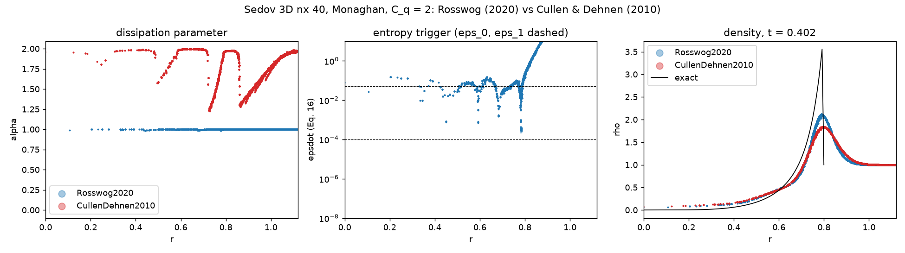

# AV_PLAN Phase 2 — Rosswog (2020) entropy trigger, results (2026-10-06)

Host: Monaghan (`C_l = 1`, `C_q = 0` default and the `C_q = 2` family), trigger at the paper's constants
(`alpha_0 = 0`, `alpha_max = 1`, `eps_0 = 1e-4`, `eps_1 = 5e-2`, decay `30 tau`, `h = support/2`).
Implementation notes: AV_PLAN Phase 2 "As built". `none` = NoneSwitch, i.e. **alpha fixed at 1**, not zero dissipation.

**Reference.** The M0e baseline is stale since 013a22f (adaptive-h clamp, OPEN_PROBLEMS §20): all 30 smoke pairs moved,
`none` included. The comparison columns below are a fresh none / C&D reference at HEAD 45375e8
(`results/av_M2_ref_{none,cd,noneQ,cdQ}`). Isolation: the smoke profile on a clean HEAD worktree and on the working tree
with Rosswog2020 added is bit-identical on all 30 pairs, so the trigger moves no existing number.
Lock: `rosswog2020Q` x sod / noh / sedov / gresho run twice, bit-identical.

Runs: `results/av_M2_rosswog2020/` (both families, all 10 cases, video), sweeps `results/av_M2_sweeps/`,
map `results/av_M2_maps/` (`scripts/probe_rosswogSedovMap.py`), probes `scripts/probe_rosswogSweeps.py`.

## Gate table (AV_PLAN Phase 2 Validation)

| Gate | Result | Verdict |
|---|---|---|
| Sod 1D: spikes < 0.5, alpha max > 0.3, alpha mean < 0.3 | P 0.029, A 0.031, 1.0, 0.146 | pass |
| Sod 1D: L1(v_x) <= C&D | 0.0033 vs 0.0046 | pass |
| Sod 2D/3D: contact spikes <= none | P 0.0725 vs 0.0715 (2D), 0.1239 vs 0.1234 (3D, nx 20); A below none in 2D | marginal fail on P (+1.4 % / +0.4 %) |
| Sedov: peak rho/rho0 approaches 4 from below | 2.69 (C_q 0), 2.12 (C_q 2), no overshoot; C&D 2.21 / 1.84 | pass, sharper than C&D |
| Noh: post-shock rho within 3 % | C_q 2: -0.07 %; C_q 0 degenerate for every switch (-48.6 %, cold gas) | pass at C_q 2 |
| Gresho: alphaMean < 0.05 and L1(v_phi) <= C&D | 0.0506, 0.0857 vs 0.0810 (nx 100); 0.0287 at nx 200 | marginal fail at nx 100 |
| Kelvin-Helmholtz: A(1.5) >= C&D | 0.0201 vs 0.0803 (none 0.0204) | **fail** |
| Resolution (Gresho nx 50/100/200): alphaMean non-increasing | 0.077 / 0.051 / 0.029 | pass |
| Timestep (Sod, cfl 0.3 vs 0.15): alpha within 10 % L1 | 5.8 % | pass |

## Findings

1. **Kelvin-Helmholtz is suppressed.** The trigger fires along the density-contrast shear layer (alphaMean 0.11 vs C&D 0.066)
   and the billows shear flat instead of rolling up (frames: `results/av_M2_rosswog2020/runs/rosswog2020_kelvinHelmholtz`
   vs `results/av_M2_ref_cd/runs/cullenDehnen2010_kelvinHelmholtz`); A(1.5) equals the fixed alpha = 1 run. Most likely
   standard SPH's contact error: summation density changes as particles slide along the rho 1:2 interface while u evolves
   adiabatically, so s = P/rho^gamma is noisy there. The paper says schemes without MAGMA2's velocity reconstruction may need
   different parameters; it does not say which. Not yet confirmed by an epsdot map of KH.
2. **Low-resolution floor.** At Sod nx 100 (62 particles per half) the rarefaction's ~1 % entropy error gives epsdot ~ 3e-3 and
   alpha 0.5-0.9 there; at nx 400 / 800 smooth regions are at alpha < 0.03 (paper: ~0.01). Same trend on Gresho (the
   resolution row above): alpha falls ~1.7x per resolution doubling.
3. **Cold gas saturates the trigger.** Sedov's background has u = 0 exactly, so s = 0 and tau = h/c is infinite: any entropy
   the precursor makes is an infinite relative rate and alpha = 1 ahead of the shock. Inside the blast epsdot stays 0.02-0.1
   (>= eps_1), so alpha ~ 1 everywhere (the paper: ~1 at the shock, ~0.4 inside, at 200^3 with MAGMA2). Rosswog's own Sedov
   uses u_bg = 1e-10 u_c (float64). C&D is saturated at its alpha_max = 2 almost everywhere too. See the map:

4. Smooth and wave cases are where it beats C&D: linear wave alpha = 0 exactly (C&D 0.038, error 0.0033 vs 0.0037),
   Yee peak-speed ratio 0.997 vs 0.959, Sedov peak 2.69 vs 2.21.

## Tables (final-time metrics)

### C_q=0

**sod**

| metric | none | cullenDehnen2010 | rosswog2020 |
|---|---|---|---|
| L1_vx | 0.003215 | 0.004558 | 0.003297 |
| contactSpikeP | 0.02568 | 0.03882 | 0.02906 |
| contactSpikeA | 0.03006 | 0.02365 | 0.03122 |
| R3_rho_err | -0.001058 | -0.0006741 | 2.66e-05 |
| R4_rho_err | -0.003682 | -0.002779 | -0.003455 |
| R4_P_err | -0.000812 | -0.003459 | -0.0009297 |
| alphaMean | 1 | 0.07457 | 0.1457 |
| alphaMax | 1 | 0.9414 | 1 |
| avEnergyTotal | 0.01052 | 0.009992 | 0.01044 |

**sod2d**

| metric | none | cullenDehnen2010 | rosswog2020 |
|---|---|---|---|
| L1_vx | 0.01697 | 0.01723 | 0.01656 |
| contactSpikeP | 0.07152 | 0.08483 | 0.07253 |
| contactSpikeA | 0.02829 | 0.01655 | 0.02748 |
| alphaMean | 1 | 0.2807 | 0.244 |

**sod3d**

| metric | none | cullenDehnen2010 | rosswog2020 |
|---|---|---|---|
| L1_vx | 0.05835 | 0.05656 | 0.05762 |
| contactSpikeP | 0.1234 | 0.132 | 0.1239 |
| contactSpikeA | -0.1486 | -0.1462 | -0.1499 |
| alphaMean | 1 | 0.8262 | 0.5943 |

**sedov**

| metric | none | cullenDehnen2010 | rosswog2020 |
|---|---|---|---|
| peakRhoRatio | 2.749 | 2.21 | 2.687 |
| peakOvershoots | False | False | False |
| shockRadiusErr | -0.004899 | 0.004232 | -0.007499 |
| energyDrift | 0.0005223 | 0.0005308 | 0.0005118 |
| alphaMean | 1 | 1.797 | 0.9848 |

**noh**

| metric | none | cullenDehnen2010 | rosswog2020 |
|---|---|---|---|
| postShockRhoErr | -0.4862 | -0.4862 | -0.4862 |
| alphaMean | 1 | 1.43 | 0 |
| energyDrift | 0 | 0 | 0 |

**gresho**

| metric | none | cullenDehnen2010 | rosswog2020 |
|---|---|---|---|
| L1_vphi | 0.2122 | 0.08095 | 0.0857 |
| peakSpeed | 0.3405 | 0.7915 | 0.7675 |
| angularMomentumLoss | 0.1768 | 0.01056 | 0.01116 |
| alphaMean | 1 | 0.04215 | 0.05062 |
| alphaMax | 1 | 0.1735 | 0.2776 |

**yee**

| metric | none | cullenDehnen2010 | rosswog2020 |
|---|---|---|---|
| L1_speed | 0.04497 | 0.01261 | 0.01182 |
| peakSpeedRatio | 0.8365 | 0.9589 | 0.9966 |
| alphaMean | 1 | 0.05546 | 0.03863 |

**linearWave**

| metric | none | cullenDehnen2010 | rosswog2020 |
|---|---|---|---|
| waveVelocityErr | 0.02644 | 0.003734 | 0.003297 |
| alphaMean | 1 | 0.03806 | 0 |

**kelvinHelmholtz**

| metric | none | cullenDehnen2010 | rosswog2020 |
|---|---|---|---|
| khAmplitudeAt1p5 | 0.02038 | 0.08028 | 0.02013 |
| khAmplitudeMax | 0.02064 | 0.08028 | 0.02434 |
| alphaMean | 1 | 0.06581 | 0.1142 |

**rayleighTaylor**

| metric | none | cullenDehnen2010 | rosswog2020 |
|---|---|---|---|
| mixingWidth | 0.2716 | 0.3977 | 0.4093 |
| maxVelocity | 0.1652 | 0.3881 | 0.332 |
| alphaMean | 1 | 0.04756 | 0.1071 |

### C_q=2

**sod**

| metric | noneQ | cullenDehnen2010Q | rosswog2020Q |
|---|---|---|---|
| L1_vx | 0.003414 | 0.00433 | 0.003471 |
| contactSpikeP | 0.02373 | 0.04474 | 0.02908 |
| contactSpikeA | 0.03441 | 0.03575 | 0.03574 |
| R3_rho_err | -0.001439 | -0.001526 | -0.0004321 |
| R4_rho_err | -0.004223 | -0.0006977 | -0.003889 |
| R4_P_err | -0.001114 | -0.001734 | -0.00117 |
| alphaMean | 1 | 0.06387 | 0.1494 |
| alphaMax | 1 | 0.8011 | 0.9996 |
| avEnergyTotal | 0.0111 | 0.01023 | 0.01102 |

**sod2d**

| metric | noneQ | cullenDehnen2010Q | rosswog2020Q |
|---|---|---|---|
| L1_vx | - | - | 0.01959 |
| contactSpikeP | - | - | 0.0741 |
| contactSpikeA | - | - | 0.0411 |
| alphaMean | - | - | 0.2466 |

**sod3d**

| metric | noneQ | cullenDehnen2010Q | rosswog2020Q |
|---|---|---|---|
| L1_vx | - | - | 0.05446 |
| contactSpikeP | - | - | 0.1403 |
| contactSpikeA | - | - | -0.4017 |
| alphaMean | - | - | 0.5943 |

**sedov**

| metric | noneQ | cullenDehnen2010Q | rosswog2020Q |
|---|---|---|---|
| peakRhoRatio | 2.118 | 1.841 | 2.117 |
| peakOvershoots | False | False | False |
| shockRadiusErr | -0.0124 | -0.002505 | -0.01229 |
| energyDrift | 0.0005219 | 0.0005317 | 0.0005087 |
| alphaMean | 1 | 1.804 | 0.9908 |

**noh**

| metric | noneQ | cullenDehnen2010Q | rosswog2020Q |
|---|---|---|---|
| postShockRhoErr | -0.0006945 | 0.0004574 | -0.0007293 |
| alphaMean | 1 | 0.4343 | 0.4552 |
| energyDrift | 2.503e-06 | 1.311e-05 | 2.98e-06 |

**gresho**

| metric | noneQ | cullenDehnen2010Q | rosswog2020Q |
|---|---|---|---|
| L1_vphi | 0.2127 | 0.08159 | 0.08661 |
| peakSpeed | 0.3355 | 0.7673 | 0.7402 |
| angularMomentumLoss | 0.1825 | 0.01115 | 0.0125 |
| alphaMean | 1 | 0.04199 | 0.04863 |
| alphaMax | 1 | 0.1816 | 0.2354 |

**yee**

| metric | noneQ | cullenDehnen2010Q | rosswog2020Q |
|---|---|---|---|
| L1_speed | - | - | 0.0162 |
| peakSpeedRatio | - | - | 0.9707 |
| alphaMean | - | - | 0.04565 |

**linearWave**

| metric | noneQ | cullenDehnen2010Q | rosswog2020Q |
|---|---|---|---|
| waveVelocityErr | - | - | 0.003297 |
| alphaMean | - | - | 0 |

**kelvinHelmholtz**

| metric | noneQ | cullenDehnen2010Q | rosswog2020Q |
|---|---|---|---|
| khAmplitudeAt1p5 | - | - | 0.01702 |
| khAmplitudeMax | - | - | 0.02147 |
| alphaMean | - | - | 0.1091 |

**rayleighTaylor**

| metric | noneQ | cullenDehnen2010Q | rosswog2020Q |
|---|---|---|---|
| mixingWidth | - | - | 0.4127 |
| maxVelocity | - | - | 0.3489 |
| alphaMean | - | - | 0.1042 |
