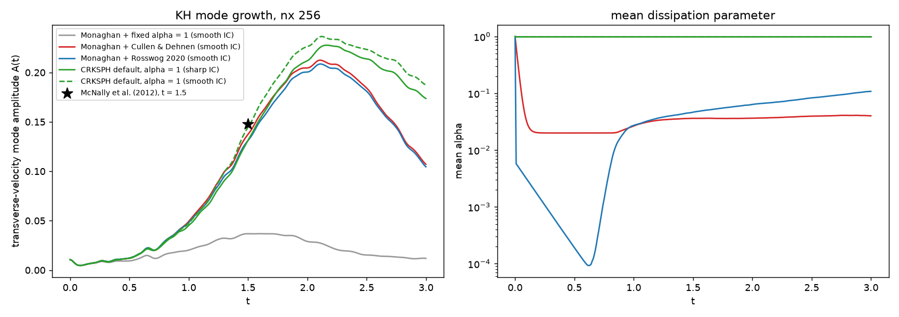

# Kelvin-Helmholtz at nx 256, out to t = 3 (2026-10-07)

Open item from AV_PLAN Phase 2: the Rosswog (2020) entropy trigger failed KH at nx 128 (A(1.5) 0.012 vs C&D 0.098 on the sharp IC; 0.037 on the
smooth IC). Everything here is nx 256 (65 536 particles), t = 3 (twice the earlier reach, so the billows roll up fully), video on, no velocity alarms.
Driver `scripts/probe_rosswogKHMap.py` (`--scheme`, `--switch`, `--smooth`, `--nx`, `--tLimit`), comparison `scripts/plot_kh256_series.py`.
Amplitude = McNally et al. (2012) transverse-velocity mode, the AV report's `khAmplitude`; their A(1.5) = 0.1479.

| run | A(1.5) | A max | t at max | A(t = 3) | alpha mean (final) |
|---|---|---|---|---|---|
| Monaghan + fixed alpha = 1 (smooth IC) | 0.0368 | 0.0369 | 1.60 | 0.0119 | 1.0000 |
| Monaghan + Cullen & Dehnen (smooth IC) | 0.1374 | 0.2124 | 2.10 | 0.1071 | 0.0402 |
| Monaghan + Rosswog 2020 (smooth IC) | 0.1311 | 0.2086 | 2.11 | 0.1045 | 0.1082 |
| CRKSPH default, alpha = 1 (sharp IC) | 0.1313 | 0.2276 | 2.16 | 0.1737 | 1.0000 |
| CRKSPH default, alpha = 1 (smooth IC) | 0.1446 | 0.2364 | 2.12 | 0.1873 | 1.0000 |

* **The Rosswog failure was resolution plus the contact transient, not the trigger.** At nx 256 Rosswog reaches A(1.5) = 0.131 (nx 128: 0.037), 95 % of Cullen & Dehnen's 0.137 and 89 % of McNally's
  0.148; its alpha falls to ~1e-4 while the layer is laminar (t ~ 0.6) and rises on the roll-up filaments only (maps). It tracks C&D to within 5 % over the whole run. Strictly the Phase 2 gate
  (`A(1.5) >= C&D`) is still missed by 4.6 %, and it was measured on the smooth IC; the sharp IC at nx 256 was not run for the Monaghan switches.
* Fixed alpha = 1 on the Monaghan host never develops the instability (A peaks at 0.037 and decays): the over-dissipation that the switches exist to remove.
* **Default CRKSPH (alpha = 1, Frontiere viscosity with the slope limiter) is the best of the lot**, as expected: 0.131 at t = 1.5 on the sharp IC (0.145 on the smooth IC, 98 % of McNally), a higher peak (0.23-0.24)
  and it keeps the amplitude after saturation (0.17-0.19 at t = 3 against ~0.105 for the Monaghan runs). The smooth IC helps CRK a little too (+10 % at t = 1.5).
* Monaghan + C&D / Rosswog saturate ~10 % below CRK and then lose amplitude faster; the pair operator's limiter, not the detector, is the remaining difference -- which is exactly what Phase 3/4 (reconstruction) address.

Maps (rows: epsdot where the trigger exists, alpha, density; columns t = 0.5 ... 2.99): `map_*.png`.
