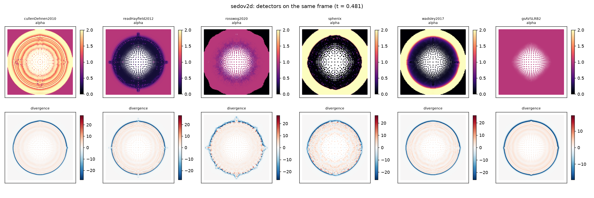
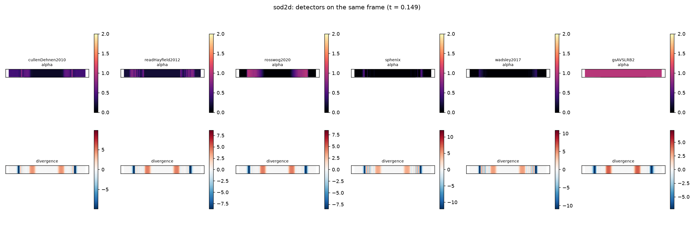

# AV_PLAN sweep verdict -- av_sweep_2026-10-07_17-30

41 pass, 21 fail, 0 missing, 29 info. A FAIL is a finding to read against the phase text, not automatically a bug.

## Jobs

| job | rc | minutes |
|---|---|---|
| phase4 | 0 | 80.1 |
| phase6 | 0 | 16.1 |
| noh2d | 0 | 2.0 |
| noh2dOthers | 0 | 1.9 |
| phase5b | 0 | 14.5 |
| cfl4 | 1 | 0.1 |
| phase5a | 0 | 51.8 |
| phase7cross | 0 | 97.5 |
| kh256_gsAVSLRB2 | 0 | 13.1 |
| kh256_gsAVSLR | 0 | 26.8 |
| kh256_noneLimited | 0 | 24.4 |
| kh256_sphenix | 0 | 17.9 |
| kh256_wadsley2017 | 0 | 13.8 |
| kh256_rosswogLimited | 0 | 10.1 |
| phase3crk | 0 | 28.5 |
| phase3 | 0 | 15.6 |
| baselineNew | 0 | 11.4 |
| phase2New | 0 | 1.9 |
| maps | 0 | nan |
| timing | 0 | nan |

## Phase 3

| check | status | detail |
|---|---|---|
| crkNone/sod energy drift <= 1e-4 | PASS | 3.829e-06 |
| crkNone/sod Group A vs stored reference (plan: 1e-6) | INFO | max rel 0.0003635 (float32 round-off from code motion: see Phase 3 notes) |
| crkNone/sedov energy drift <= 1e-4 | PASS | 5.96e-08 |
| crkNone/sedov Group A vs stored reference (plan: 1e-6) | INFO | max rel 3.767e-06 (float32 round-off from code motion: see Phase 3 notes) |
| crkNone/sod2d energy drift <= 1e-4 | PASS | 8.058e-06 |
| crkNone/sod2d Group A vs stored reference (plan: 1e-6) | INFO | max rel 0.0007093 (float32 round-off from code motion: see Phase 3 notes) |
| crkNone/sod3d energy drift <= 1e-4 | PASS | 2.505e-05 |
| crkNone/sod3d Group A vs stored reference (plan: 1e-6) | INFO | max rel 2.208e-07 (float32 round-off from code motion: see Phase 3 notes) |
| crkNone/noh energy drift <= 1e-4 | PASS | 2.623e-06 |
| crkNone/noh Group A vs stored reference (plan: 1e-6) | INFO | max rel 0.0008877 (float32 round-off from code motion: see Phase 3 notes) |
| crkCullenDehnen2010/sod energy drift <= 1e-4 | PASS | 3.829e-06 |
| crkCullenDehnen2010/sod Group A vs stored reference (plan: 1e-6) | INFO | max rel 0.6384 (float32 round-off from code motion: see Phase 3 notes) |
| crkCullenDehnen2010/sedov energy drift <= 1e-4 | PASS | 5.96e-08 |
| crkCullenDehnen2010/sedov Group A vs stored reference (plan: 1e-6) | INFO | max rel 0.3255 (float32 round-off from code motion: see Phase 3 notes) |
| crkCullenDehnen2010/sod2d energy drift <= 1e-4 | PASS | 8.058e-06 |
| crkCullenDehnen2010/sod2d Group A vs stored reference (plan: 1e-6) | INFO | max rel 112.7 (float32 round-off from code motion: see Phase 3 notes) |
| crkCullenDehnen2010/sod3d energy drift <= 1e-4 | PASS | 2.48e-05 |
| crkCullenDehnen2010/sod3d Group A vs stored reference (plan: 1e-6) | INFO | max rel 0.03258 (float32 round-off from code motion: see Phase 3 notes) |
| crkCullenDehnen2010/noh energy drift <= 1e-4 | PASS | 5.364e-07 |
| crkCullenDehnen2010/noh Group A vs stored reference (plan: 1e-6) | INFO | max rel 0.2317 (float32 round-off from code motion: see Phase 3 notes) |
| Monaghan + noneLinear runs sod clean | PASS | ok |
| Monaghan + noneLinear runs gresho clean | PASS | ok |
| Monaghan + noneLinear runs sedov clean | PASS | ok |
| Monaghan + noneLinear runs noh clean | PASS | ok |
| Monaghan + noneLinear runs kelvinHelmholtz clean | PASS | ok |
| Monaghan + noneLimited runs sod clean | PASS | ok |
| Monaghan + noneLimited runs gresho clean | PASS | ok |
| Monaghan + noneLimited runs sedov clean | PASS | ok |
| Monaghan + noneLimited runs noh clean | PASS | ok |
| Monaghan + noneLimited runs kelvinHelmholtz clean | PASS | ok |

## Phase 4

| check | status | detail |
|---|---|---|
| Sod: L1(v_x) AVSLRB2 <= AVSW | PASS | 0.003689 vs 0.003956 |
| Sedov: gsAVSLR overshoots rho/rho0 = 4 | **FAIL** | 2.276 |
| Sedov: gsAVSWSLR overshoots rho/rho0 = 4 | **FAIL** | 2.107 |
| Sedov: gsAVSLRB2 stays below rho/rho0 = 4 | PASS | 2.124 |
| Sedov peak rho/rho0 gsAVSLRB | INFO | 2.111 |
| Sedov peak rho/rho0 gsAV | INFO | 2.097 |
| Gresho L1(v_phi): SLR family < AVSW < AV (strict) | **FAIL** | AV 0.2101, AVSW 0.07868, AVSLR 0.08987, AVSWSLR 0.05835, AVSLRB 0.09851, AVSLRB2 0.08874 |
| KH A(1.5): AV < AVSW < SLR family | PASS | AV 0.01887, AVSW 0.08211, AVSLR 0.09835, AVSWSLR 0.1309, AVSLRB 0.09164, AVSLRB2 0.09661 (paper: 2.87, 8.31, 12.58, 12.14, 12.01, 12.52 e-2; McNally 14.79e-2) |
| KH: SLR family >= 1.4 x AVSW | **FAIL** | min SLR 0.09164 |
| RT: mixing width AVSLRB2 >= AVSW | **FAIL** | 0.3792 vs 0.388 |
| HEADLINE: Gresho AV energy raw / reconstructed >= 10 | **FAIL** | raw 0.06629, SLR 0.03153, ratio 2.102; linear/quadratic raw 0.0648/0.001496, SLR 0.03097/0.0005605 |

## Phase 5A

| check | status | detail |
|---|---|---|
| CD sod: coupled within 5% of fixed beta = 2 | **FAIL** | worst contactSpikeP 15.05% (tol 5%; *_err metrics also pass within 0.01 absolute) |
| CD noh: coupled within 5% of fixed beta = 2 | PASS | worst - 0.00% (tol 5%; *_err metrics also pass within 0.01 absolute) |
| CD sedov: coupled within 5% of fixed beta = 2 | PASS | worst peakRhoRatio 4.59% (tol 5%; *_err metrics also pass within 0.01 absolute) |
| CD Gresho angularMomentumLoss: coupled < fixed 2 | PASS | 0.00715 vs 0.007201 (beta 0.2: 0.007923) |
| CD Gresho avEnergyQuadratic: coupled < fixed 2 | PASS | 0.001407 vs 0.01428 (beta 0.2: 0.002143) |
| CD shearing Noh: quadratic AV energy lower coupled | PASS | 2.951 vs 4.02 |
| CD shearing Noh: front within 3% | **FAIL** | 0.2746 vs 0.318 (exact 0.1999) |
| CD shear box: quadratic dominates at fixed beta, suppressed coupled | **FAIL** | quadratic fraction fixed 0.4069, coupled 0.04855; mode amplitude fixed 0.9803, coupled 0.9879 |
| CD sod: Chen & Nixon ratio median (fixed / coupled) | INFO | 0.007176 / 0.0008139 |
| CD gresho: Chen & Nixon ratio median (fixed / coupled) | INFO | 0.05101 / 0.002128 |
| CD shearBox: Chen & Nixon ratio median (fixed / coupled) | INFO | 0.01449 / 0.0003397 |
| Rosswog sod: coupled within 5% of fixed beta = 2 | PASS | worst contactSpikeP 0.58% (tol 5%; *_err metrics also pass within 0.01 absolute) |
| Rosswog noh: coupled within 5% of fixed beta = 2 | PASS | worst - 0.00% (tol 5%; *_err metrics also pass within 0.01 absolute) |
| Rosswog sedov: coupled within 5% of fixed beta = 2 | PASS | worst peakRhoRatio 0.00% (tol 5%; *_err metrics also pass within 0.01 absolute) |
| Rosswog Gresho angularMomentumLoss: coupled < fixed 2 | **FAIL** | 0.007338 vs 0.007321 (beta 0.2: 0.006025) |
| Rosswog Gresho avEnergyQuadratic: coupled < fixed 2 | PASS | 0.001307 vs 0.01062 (beta 0.2: 0.001307) |
| Rosswog shearing Noh: quadratic AV energy lower coupled | PASS | 3.819 vs 3.821 |
| Rosswog shearing Noh: front within 3% | PASS | 0.3509 vs 0.3511 (exact 0.1999) |
| Rosswog shear box: quadratic dominates at fixed beta, suppressed coupled | PASS | quadratic fraction fixed 0.7763, coupled 0.0531; mode amplitude fixed 0.9897, coupled 0.9978 |
| Rosswog sod: Chen & Nixon ratio median (fixed / coupled) | INFO | 0.3419 / 0.06438 |
| Rosswog gresho: Chen & Nixon ratio median (fixed / coupled) | INFO | 0.2141 / 0.001735 |
| Rosswog shearBox: Chen & Nixon ratio median (fixed / coupled) | INFO | 0.04658 / 7.709e-05 |

## Phase 5B

| check | status | detail |
|---|---|---|
| sod: Group A within 5% of C&D or C&D-Q | **FAIL** | vs C&D (C_q 0): worst L1_vx 161.20% (tol 5%; *_err metrics also pass within 0.01 absolute) | vs C&D-Q (C_q 2): worst L1_vx 196.56% (tol 5%; *_err metrics also pass within 0.01 absolute) |
| sod2d: Group A within 5% of C&D or C&D-Q | **FAIL** | vs C&D (C_q 0): worst R4_P_err 286.83% (tol 5%; *_err metrics also pass within 0.01 absolute) | vs C&D-Q (C_q 2): no C&D-Q run |
| sod3d: Group A within 5% of C&D or C&D-Q | **FAIL** | vs C&D (C_q 0): worst R4_P_err 157.46% (tol 5%; *_err metrics also pass within 0.01 absolute) | vs C&D-Q (C_q 2): no C&D-Q run |
| sedov: Group A within 5% of C&D or C&D-Q | **FAIL** | vs C&D (C_q 0): worst shockRadiusErr 274.22% (tol 5%; *_err metrics also pass within 0.01 absolute) | vs C&D-Q (C_q 2): worst shockRadiusErr 1440.49% (tol 5%; *_err metrics also pass within 0.01 absolute) |
| noh: Group A within 5% of C&D or C&D-Q | PASS | vs C&D (C_q 0): worst postShockRhoErr 100.34% (tol 5%; *_err metrics also pass within 0.01 absolute) | vs C&D-Q (C_q 2): worst - 0.00% (tol 5%; *_err metrics also pass within 0.01 absolute) |
| Gresho L1_vphi <= C&D | **FAIL** | 0.0898 vs 0.07263 |
| Gresho alphaMean <= C&D | PASS | 0.01557 vs 0.04191 |
| KH A(1.5) >= C&D | PASS | 0.1051 vs 0.1001 |
| ms/step >= 15% lower than C&D | **FAIL** | sphenix 9.177, C&D 10.32, none 8.256 ms/step |
| cfl x 4 on sod: sphenix / C&D diverged | INFO | True / True |
| cfl x 4 on sedov: sphenix / C&D diverged | INFO | False / False |
| cfl x 4 on noh: sphenix / C&D diverged | INFO | False / False |
| cfl x 4 on gresho: sphenix / C&D diverged | INFO | True / True |

## Phase 6

| check | status | detail |
|---|---|---|
| sod: Group A within 5% of one of C&D(-Q) / Rosswog(-Q) / Sphenix | **FAIL** | worst L1_vx 76.16% (tol 5%; *_err metrics also pass within 0.01 absolute) |
| sedov: Group A within 5% of one of C&D(-Q) / Rosswog(-Q) / Sphenix | **FAIL** | worst shockRadiusErr 111.52% (tol 5%; *_err metrics also pass within 0.01 absolute) |
| noh: Group A within 5% of one of C&D(-Q) / Rosswog(-Q) / Sphenix | PASS | cullenDehnen2010Q: worst - 0.00% (tol 5%; *_err metrics also pass within 0.01 absolute) |
| Gresho L1(v_phi) <= C&D | PASS | 0.06743 vs 0.07263 |
| cylindrical Noh preShockAlphaMean: Wadsley materially (< 1/2) below C&D | PASS | 4.332e-08 vs 0.7216 (Rosswog 0, Sphenix 1.068) |
| cylindrical Noh alphaActiveFraction: Wadsley materially (< 1/2) below C&D | **FAIL** | 0.393 vs 0.7808 (Rosswog 0, Sphenix 0.5954) |
| KH growth >= C&D | **FAIL** | 0.08088 vs 0.1001 |
| RT growth >= C&D | **FAIL** | 0.3174 vs 0.3827 |

## KH nx 256

| check | status | detail |
|---|---|---|
| reference (docs/av/kh256_2026-10-07) | INFO | Monaghan C&D / Rosswog peak 0.21 -> 0.105 at t = 3; default CRK peak 0.23-0.24, holds 0.17-0.19 |
| gsAVSLR | INFO | peak 0.2089, A(1.5) 0.1393, final 0.1214 |
| gsAVSLRB2 | INFO | peak 0.2082, A(1.5) 0.1381, final 0.1177 |
| noneLimited | INFO | peak 0.2091, A(1.5) 0.1395, final 0.1208 |
| rosswogLimited | INFO | peak 0.2237, A(1.5) 0.1507, final 0.1226 |
| sphenix | INFO | peak 0.2187, A(1.5) 0.1506, final 0.1032 |
| wadsley2017 | INFO | peak 0.2124, A(1.5) 0.1332, final 0.1087 |

## Phase 7: the Part 0 table (every config this sweep ran)

### gresho

| config | L1_vphi | peakSpeed | angularMomentumLoss | alphaMean | avEnergyTotal | avEnergyQuadratic | energyDrift |
|---|---|---|---|---|---|---|---|
| cnCDCoupled2 | 0.07417 | 0.797 | 0.00715 | 0.04149 | 0.02664 | 0.001407 | 2.169e-05 |
| cnCDFixed0p2 | 0.07335 | 0.7963 | 0.007923 | 0.04044 | 0.02644 | 0.002143 | 2.103e-05 |
| cnCDFixed2 | 0.07775 | 0.7574 | 0.007201 | 0.02851 | 0.02814 | 0.01428 | 9.629e-06 |
| cnRosswogCoupled2 | 0.07821 | 0.755 | 0.007338 | 0.04688 | 0.02796 | 0.001307 | 8.854e-06 |
| cnRosswogFixed0p2 | 0.07938 | 0.7565 | 0.006025 | 0.04543 | 0.02845 | 0.001307 | 8.633e-06 |
| cnRosswogFixed2 | 0.08313 | 0.7538 | 0.007321 | 0.03043 | 0.02946 | 0.01062 | 5.202e-06 |
| crkCullenDehnen2010 | 0.02629 | 1.076 | -0.001501 | 0.02677 | n/a | n/a | 0 |
| crkNone | 0.03317 | 1.013 | -0.0002492 | 1 | n/a | n/a | 1.107e-07 |
| cullenDehnen2010Cfl4 | DIVERGED | DIVERGED | DIVERGED | DIVERGED | DIVERGED | DIVERGED | DIVERGED |
| gsAV | 0.2101 | 0.3484 | 0.1775 | 1 | 0.06629 | 0.001496 | 1.107e-07 |
| gsAVSLR | 0.08987 | 0.7066 | 0.0002954 | 1 | 0.03153 | 0.0005605 | 1.107e-07 |
| gsAVSLRB | 0.09851 | 0.6717 | 0.003861 | 1 | 0.03457 | 0.0005973 | 2.213e-07 |
| gsAVSLRB2 | 0.08874 | 0.691 | 0.0003754 | 1 | 0.03137 | 0.0005539 | 2.213e-07 |
| gsAVSW | 0.07868 | 0.7416 | 0.007594 | 0.05083 | 0.02863 | 0.01291 | 7.194e-06 |
| gsAVSWSLR | 0.05835 | 0.8498 | 0.00586 | 0.05466 | 0.02135 | 0.009101 | 8.854e-06 |
| noneLimited | 0.08819 | 0.6914 | -0.001491 | 1 | 0.03154 | 0 | 2.213e-07 |
| noneLinear | 0.08619 | 0.732 | -0.003309 | 1 | 0.02985 | 0 | 2.213e-07 |
| rosswogLimited | 0.05874 | 0.8386 | 0.005669 | 0.04374 | 0.02183 | 0.00612 | 5.423e-06 |
| rosswogLimitedCoupled | 0.06025 | 0.8161 | 0.00649 | 0.05775 | 0.02205 | 0.0009211 | 7.969e-06 |
| sphenix | 0.0898 | 0.9895 | 0.004334 | 0.01557 | 0.03662 | 0.003109 | 0.0008141 |
| sphenixCfl4 | DIVERGED | DIVERGED | DIVERGED | DIVERGED | DIVERGED | DIVERGED | DIVERGED |
| wadsley2017 | 0.06743 | 0.8429 | 0.00576 | 0.02234 | 0.02494 | 0.01303 | 8.821e-05 |
| wadsleyLimited | 0.06063 | 0.8389 | 0.005469 | 0.02572 | 0.02276 | 0.01132 | 0.0001255 |

### kelvinHelmholtz

| config | khAmplitude0 | khAmplitudeAt1p5 | khAmplitudeMax | khReference1p5 | alphaMean | avEnergyTotal | avEnergyQuadratic | energyDrift |
|---|---|---|---|---|---|---|---|---|
| crkCullenDehnen2010 | 0.01054 | 0.1231 | 0.1231 | 0.1479 | 0.04788 | n/a | n/a | 0 |
| crkNone | 0.01054 | 0.09044 | 0.09044 | 0.1479 | 1 | n/a | n/a | 6.099e-08 |
| gsAV | 0.01054 | 0.01887 | 0.01901 | 0.1479 | 1 | 0.03233 | 0.001575 | 6.099e-07 |
| gsAVSLR | 0.01054 | 0.09835 | 0.09835 | 0.1479 | 1 | 0.005879 | 0.0001743 | 5.489e-07 |
| gsAVSLRB | 0.01054 | 0.09164 | 0.09164 | 0.1479 | 1 | 0.006597 | 0.0001788 | 5.489e-07 |
| gsAVSLRB2 | 0.01054 | 0.09661 | 0.09661 | 0.1479 | 1 | 0.006092 | 0.0001798 | 6.099e-07 |
| gsAVSW | 0.01054 | 0.08211 | 0.08211 | 0.1479 | 0.06586 | 0.007905 | 0.00445 | 1.22e-07 |
| gsAVSWSLR | 0.01054 | 0.1309 | 0.1309 | 0.1479 | 0.09383 | 0.003072 | 0.001462 | 6.099e-07 |
| noneLimited | 0.01054 | 0.1002 | 0.1002 | 0.1479 | 1 | 0.005768 | 0 | 5.489e-07 |
| noneLinear | 0.01054 | 0.09769 | 0.09769 | 0.1479 | 1 | 0.00448 | 0 | 4.879e-07 |
| rosswogLimited | 0.01054 | 0.1158 | 0.1158 | 0.1479 | 0.1304 | 0.004477 | 0.0004142 | 1.83e-07 |
| rosswogLimitedCoupled | 0.01054 | 0.1157 | 0.1157 | 0.1479 | 0.1365 | 0.004575 | 0.0001931 | 1.22e-07 |
| sphenix | 0.01054 | 0.1051 | 0.1051 | 0.1479 | 0.01364 | 0.002657 | 0.0002846 | 3.793e-05 |
| wadsley2017 | 0.01054 | 0.08088 | 0.08088 | 0.1479 | 0.02777 | 0.007358 | 0.005021 | 6.465e-06 |
| wadsleyLimited | 0.01054 | 0.09127 | 0.09127 | 0.1479 | 0.03093 | 0.00574 | 0.003768 | 8.294e-06 |

### linearWave

| config | waveVelocityErr | waveVelocityCoefficient | waveExactCoefficient | waveResidualRms | alphaMean | avEnergyTotal | avEnergyQuadratic | energyDrift |
|---|---|---|---|---|---|---|---|---|
| crkCullenDehnen2010 | 0.004284 | -0.9957 | -1 | 0.07515 | 0.03807 | n/a | n/a | 6.624e-08 |
| crkNone | 0.007155 | -0.9928 | -1 | 0.06936 | 1 | n/a | n/a | 6.624e-08 |
| rosswogLimited | 0.005011 | -1.005 | -1 | 0.1047 | 0 | 4.766e-14 | 4.311e-14 | 0 |
| rosswogLimitedCoupled | 0.005588 | -1.006 | -1 | 0.1087 | 0 | 4.55e-15 | 2.331e-22 | 0 |
| sphenix | 0.007903 | -0.9921 | -1 | 0.1037 | 6.232e-06 | 2.018e-13 | 1.731e-18 | 0 |
| wadsley2017 | 0.0006465 | -1.001 | -1 | 0.1051 | 1.673e-05 | 1.636e-12 | 5.124e-14 | 0 |
| wadsleyLimited | 0.002917 | -0.9971 | -1 | 0.1066 | 1.615e-05 | 6.504e-14 | 3.657e-14 | 0 |

### noh

| config | postShockRhoErr | postShockRhoExact | alphaMean | avEnergyTotal | avEnergyQuadratic | energyDrift |
|---|---|---|---|---|---|---|
| cnCDCoupled2 | 0.0007287 | 4 | 0.4337 | 0.4455 | 0.269 | 1.347e-05 |
| cnCDFixed0p2 | -0.0004532 | 4 | 0.4552 | 0.442 | 0.05994 | 2.503e-06 |
| cnCDFixed2 | -0.0004564 | 4 | 0.4298 | 0.4415 | 0.2371 | 3.457e-06 |
| cnRosswogCoupled2 | -0.0008189 | 4 | 0.4557 | 0.4548 | 0.2912 | 3.159e-06 |
| cnRosswogFixed0p2 | -0.005091 | 4 | 0.5004 | 0.4944 | 0.09993 | 4.768e-07 |
| cnRosswogFixed2 | -0.000817 | 4 | 0.4528 | 0.4548 | 0.2914 | 2.98e-06 |
| crkCullenDehnen2010 | 0.0002064 | 4 | 0.4357 | n/a | n/a | 5.364e-07 |
| crkNone | 0.0002688 | 4 | 1 | n/a | n/a | 2.623e-06 |
| cullenDehnen2010Cfl4 | -0.4996 | 4 | 1.425 | 0 | 0 | 0 |
| gsAV | -0.0007615 | 4 | 1 | 0.4547 | 0.2911 | 2.801e-06 |
| gsAVSLR | 0.0008886 | 4 | 1 | 0.4884 | 0.2896 | 2.027e-06 |
| gsAVSLRB | -0.0007588 | 4 | 1 | 0.4547 | 0.2911 | 2.861e-06 |
| gsAVSLRB2 | -0.00076 | 4 | 1 | 0.4547 | 0.2911 | 2.742e-06 |
| gsAVSW | -0.0009477 | 4 | 0.2997 | 0.3597 | 0.2535 | 2.444e-06 |
| gsAVSWSLR | -0.0005453 | 4 | 0.3304 | 0.2999 | 0.1834 | 5.96e-07 |
| noneLimited | -0.4996 | 4 | 1 | 0 | 0 | 0 |
| noneLinear | -0.4996 | 4 | 1 | 0 | 0 | 0 |
| rosswogLimited | 0.0008713 | 4 | 0.5188 | 0.4884 | 0.2899 | 1.907e-06 |
| rosswogLimitedCoupled | 0.0008211 | 4 | 0.5185 | 0.4886 | 0.2898 | 1.669e-06 |
| sphenix | 0.001687 | 4 | 0.2974 | 0.4501 | 0.2699 | 1.311e-06 |
| sphenixCfl4 | 0.001687 | 4 | 0.2974 | 0.4501 | 0.2699 | 1.311e-06 |
| wadsley2017 | 0.001463 | 4 | 0.2974 | 0.4442 | 0.2199 | 4.768e-07 |
| wadsleyLimited | 0.0004613 | 4 | 0.3191 | 0.4901 | 0.2288 | 6.557e-06 |

### noh2d

| config | preShockAlphaMean | postShockRhoErr | postShockRhoExact | alphaMean | avEnergyTotal | avEnergyQuadratic | energyDrift |
|---|---|---|---|---|---|---|---|
| cullenDehnen2010 | 0.7216 | -0.06535 | 16 | 0.944 | 0 | 0 | 0 |
| none | 1 | -0.06535 | 16 | 1 | 0 | 0 | 0 |
| readHayfield2012 | 0.3706 | -0.06535 | 16 | 0.4195 | 0 | 0 | 0 |
| rosswog2020 | 0 | -0.06535 | 16 | 0 | 0 | 0 | 0 |
| sphenix | 1.068 | -0.06712 | 16 | 0.6298 | 0.5357 | 0.3128 | 1.609e-06 |
| wadsley2017 | 4.332e-08 | -0.01285 | 16 | 0.1331 | 0.696 | 0.5524 | 5.126e-06 |

### rayleighTaylor

| config | heavyMinY | lightMaxY | mixingWidth | maxVelocity | alphaMean | avEnergyTotal | avEnergyQuadratic | energyDrift |
|---|---|---|---|---|---|---|---|---|
| crkCullenDehnen2010 | 0.1492 | 0.7687 | 0.6195 | 0.5978 | 0.07066 | n/a | n/a | 0.002628 |
| crkNone | 0.1792 | 0.7209 | 0.5417 | 0.4905 | 1 | n/a | n/a | 0.002857 |
| gsAV | 0.3691 | 0.6271 | 0.2579 | 0.1448 | 1 | 0.0009026 | 1.597e-05 | 0.0004324 |
| gsAVSLR | 0.2833 | 0.6822 | 0.3989 | 0.332 | 1 | 0.001211 | 2.347e-05 | 0.001466 |
| gsAVSLRB | 0.3034 | 0.6715 | 0.3681 | 0.3057 | 1 | 0.001119 | 1.916e-05 | 0.001238 |
| gsAVSLRB2 | 0.2958 | 0.675 | 0.3792 | 0.3143 | 1 | 0.001167 | 2.18e-05 | 0.001383 |
| gsAVSW | 0.2936 | 0.6816 | 0.388 | 0.3944 | 0.05464 | 0.0008051 | 0.0003922 | 0.001564 |
| gsAVSWSLR | 0.2849 | 0.6913 | 0.4064 | 0.4218 | 0.06006 | 0.0006554 | 0.0003038 | 0.001761 |
| rosswogLimited | 0.2589 | 0.7036 | 0.4448 | 0.3831 | 0.1211 | 0.001112 | 0.0001277 | 0.002067 |
| rosswogLimitedCoupled | 0.262 | 0.7041 | 0.4421 | 0.3845 | 0.124 | 0.001136 | 3.942e-05 | 0.002063 |
| sphenix | 0.3487 | 0.6451 | 0.2964 | 0.2785 | 0.003169 | 7.206e-05 | 2.258e-06 | 0.0006234 |
| wadsley2017 | 0.339 | 0.6565 | 0.3174 | 0.2766 | 0.008287 | 0.0002563 | 0.0001848 | 0.0007824 |
| wadsleyLimited | 0.3376 | 0.6592 | 0.3217 | 0.2831 | 0.009521 | 0.0002359 | 0.0001623 | 0.0008045 |

### sedov

| config | peakRhoRatio | peakRhoExact | peakOvershoots | shockRadiusErr | E0Recovery | alphaMean | avEnergyTotal | avEnergyQuadratic | energyDrift |
|---|---|---|---|---|---|---|---|---|---|
| cnCDCoupled2 | 1.833 | 4 | 0 | -0.002685 | -5.96e-08 | 1.805 | 0.5927 | 0.3463 | 0.0005308 |
| cnCDFixed0p2 | 2.126 | 4 | 0 | -0.009412 | -5.96e-08 | 1.799 | 0.4794 | 0.05099 | 0.0005289 |
| cnCDFixed2 | 1.921 | 4 | 0 | -0.003772 | -5.96e-08 | 1.804 | 0.5768 | 0.2943 | 0.000526 |
| cnRosswogCoupled2 | 2.097 | 4 | 0 | -0.01256 | -5.96e-08 | 0.9908 | 0.6046 | 0.3723 | 0.0005073 |
| cnRosswogFixed0p2 | 2.438 | 4 | 0 | -0.02471 | -5.96e-08 | 0.9856 | 0.4528 | 0.07057 | 0.0005104 |
| cnRosswogFixed2 | 2.097 | 4 | 0 | -0.01255 | -5.96e-08 | 0.9908 | 0.6046 | 0.3724 | 0.0005102 |
| crkCullenDehnen2010 | 1.916 | 4 | 0 | -0.04002 | -5.96e-08 | 1.797 | n/a | n/a | 5.96e-08 |
| crkNone | 2.119 | 4 | 0 | -0.05934 | -5.96e-08 | 1 | n/a | n/a | 5.96e-08 |
| cullenDehnen2010Cfl4 | 2.28 | 4 | 0 | -0.01871 | -5.96e-08 | 1.765 | 0.4171 | 0 | 0.007806 |
| gsAV | 2.097 | 4 | 0 | -0.01266 | -5.96e-08 | 1 | 0.5979 | 0.3682 | 0.0005209 |
| gsAVSLR | 2.276 | 4 | 0 | -0.01465 | -5.96e-08 | 1 | 0.5392 | 0.3016 | 0.0005204 |
| gsAVSLRB | 2.111 | 4 | 0 | -0.01295 | -5.96e-08 | 1 | 0.5957 | 0.365 | 0.0005207 |
| gsAVSLRB2 | 2.124 | 4 | 0 | -0.01323 | -5.96e-08 | 1 | 0.5936 | 0.3621 | 0.0005205 |
| gsAVSW | 1.956 | 4 | 0 | -0.02453 | -5.96e-08 | 0.7913 | 0.3044 | 0.1931 | 0.0005887 |
| gsAVSWSLR | 2.107 | 4 | 0 | -0.0215 | -5.96e-08 | 0.8092 | 0.2289 | 0.1333 | 0.0005878 |
| noneLimited | 2.712 | 4 | 0 | -0.03869 | -5.96e-08 | 1 | 0.3427 | 0 | 0.0005215 |
| noneLinear | 2.764 | 4 | 0 | -0.0307 | -5.96e-08 | 1 | 0.2932 | 0 | 0.0005218 |
| rosswogLimited | 2.276 | 4 | 0 | -0.01454 | -5.96e-08 | 0.989 | 0.545 | 0.305 | 0.0005105 |
| rosswogLimitedCoupled | 2.276 | 4 | 0 | -0.01455 | -5.96e-08 | 0.989 | 0.545 | 0.3049 | 0.0005083 |
| sphenix | 2.509 | 4 | 0 | -0.04136 | -5.96e-08 | 1.463 | 0.57 | 0.342 | 0.0004691 |
| sphenixCfl4 | 2.47 | 4 | 0 | -0.04202 | -5.96e-08 | 1.469 | 0.5096 | 0.3062 | 0.006832 |
| wadsley2017 | 2.262 | 4 | 0 | -0.02338 | -5.96e-08 | 1.806 | 0.4722 | 0.2068 | 0.0004994 |
| wadsleyLimited | 2.413 | 4 | 0 | -0.03179 | -5.96e-08 | 1.801 | 0.3816 | 0.1429 | 0.0005003 |

### shearBox

| config | modeAmplitudeFinal | avQuadraticFraction | alphaMean | avEnergyTotal | avEnergyQuadratic | energyDrift |
|---|---|---|---|---|---|---|
| cnCDCoupled2 | 0.9879 | 0.04855 | 0.02 | 0.001511 | 7.336e-05 | 0 |
| cnCDFixed0p2 | 0.9876 | 0.06495 | 0.02 | 0.001538 | 9.991e-05 | 0 |
| cnCDFixed2 | 0.9803 | 0.4069 | 0.02 | 0.002418 | 0.0009839 | 7.629e-08 |
| cnRosswogCoupled2 | 0.9978 | 0.0531 | 0.001116 | 0.0003076 | 1.634e-05 | 0 |
| cnRosswogFixed0p2 | 0.9973 | 0.2771 | 0.0009767 | 0.0003684 | 0.0001021 | 0 |
| cnRosswogFixed2 | 0.9897 | 0.7763 | 0.001115 | 0.001294 | 0.001005 | 0 |
| cullenDehnen2010 | 0.9885 | 0 | 0.02 | 0.001439 | 0 | 0 |
| none | 0.8504 | 0 | 1 | 0.01703 | 0 | 0 |
| readHayfield2012 | 0.9668 | 0 | 0.2 | 0.004025 | 0 | 0 |
| rosswog2020 | 0.9982 | 0 | 0.000962 | 0.0002638 | 0 | 0 |
| rosswogLimited | 0.9999 | 0.4257 | 0 | 1.317e-06 | 5.606e-07 | 7.629e-08 |
| rosswogLimitedCoupled | 0.9999 | 0.0009335 | 0 | 7.57e-07 | 7.066e-10 | 7.629e-08 |
| sphenix | 0.9999 | 0.03297 | 8.275e-06 | 1.545e-10 | 5.093e-12 | 0 |
| wadsley2017 | 0.9829 | 0.1474 | 0.06642 | 0.002058 | 0.0003033 | 2.289e-07 |
| wadsleyLimited | 0.9999 | 0.02196 | 0.04786 | 6.865e-06 | 1.508e-07 | 0 |

### shearingNoh

| config | shockFront | shockFrontExact | shockFrontErr | alphaMean | avEnergyTotal | avEnergyQuadratic | energyDrift |
|---|---|---|---|---|---|---|---|
| cnCDCoupled2 | 0.2746 | 0.1999 | 0.3737 | 0.4388 | 5.287 | 2.951 | 3.815e-06 |
| cnCDFixed0p2 | 0.2647 | 0.1999 | 0.3239 | 0.4677 | 5.282 | 0.9091 | 4.239e-06 |
| cnCDFixed2 | 0.318 | 0.1999 | 0.5906 | 0.5271 | 6.582 | 4.02 | 1.554e-06 |
| cnRosswogCoupled2 | 0.3509 | 0.1999 | 0.7551 | 0.9602 | 7.752 | 3.819 | 5.651e-07 |
| cnRosswogFixed0p2 | 0.4759 | 0.1999 | 1.38 | 0.9793 | 6.227 | 0.867 | 2.826e-07 |
| cnRosswogFixed2 | 0.3511 | 0.1999 | 0.756 | 0.9612 | 7.754 | 3.821 | 2.826e-07 |
| cullenDehnen2010 | nan | 0.1999 | nan | 0.5467 | 0 | 0 | 0 |
| none | nan | 0.1999 | nan | 1 | 0 | 0 | 0 |
| readHayfield2012 | nan | 0.1999 | nan | 0.2017 | 0 | 0 | 0 |
| rosswog2020 | nan | 0.1999 | nan | 0 | 0 | 0 | 0 |

### sod

| config | L1_vx | contactSpikeP | contactSpikeA | R3_rho_err | R4_rho_err | R4_P_err | alphaMean | avEnergyTotal | avEnergyQuadratic | energyDrift |
|---|---|---|---|---|---|---|---|---|---|---|
| cnCDCoupled2 | 0.004616 | 0.08215 | 0.03171 | -0.001763 | -0.0009495 | -0.001857 | 0.06664 | 0.01036 | 0.003906 | 1.344e-05 |
| cnCDFixed0p2 | 0.005069 | 0.1476 | 0.02235 | -0.0005583 | -0.002378 | -0.002411 | 0.07964 | 0.01021 | 0.001124 | 1.308e-05 |
| cnCDFixed2 | 0.004259 | 0.09671 | 0.04 | -0.001668 | -0.001412 | -0.001324 | 0.05958 | 0.0107 | 0.005673 | 9.392e-06 |
| cnRosswogCoupled2 | 0.003807 | 0.06785 | 0.03831 | 9.997e-05 | -0.003691 | -0.0005647 | 0.1538 | 0.01117 | 0.003329 | 3.829e-06 |
| cnRosswogFixed0p2 | 0.003675 | 0.0594 | 0.03594 | 0.0002662 | -0.003614 | -0.0006196 | 0.1515 | 0.01069 | 0.0005375 | 4.263e-06 |
| cnRosswogFixed2 | 0.003788 | 0.06825 | 0.03856 | 7.58e-05 | -0.003724 | -0.000571 | 0.154 | 0.01118 | 0.003363 | 4.118e-06 |
| crkCullenDehnen2010 | 0.008401 | 0.03151 | -0.002794 | -0.007293 | -0.005051 | -0.00812 | 0.07308 | n/a | n/a | 3.829e-06 |
| crkNone | 0.006691 | 0.0301 | 0.007274 | -0.007534 | -0.00428 | -0.004955 | 1 | n/a | n/a | 3.829e-06 |
| cullenDehnen2010Cfl4 | DIVERGED | DIVERGED | DIVERGED | DIVERGED | DIVERGED | DIVERGED | DIVERGED | DIVERGED | DIVERGED | DIVERGED |
| gsAV | 0.00369 | 0.07581 | 0.03666 | -0.001122 | -0.003813 | -0.0002102 | 1 | 0.01126 | 0.003338 | 4.046e-06 |
| gsAVSLR | 0.003849 | 0.06808 | 0.02069 | -0.0007402 | -0.003258 | -0.001587 | 1 | 0.01008 | 0.002715 | 2.312e-06 |
| gsAVSLRB | 0.003689 | 0.07571 | 0.03664 | -0.001114 | -0.003801 | -0.0001993 | 1 | 0.01126 | 0.003337 | 4.335e-06 |
| gsAVSLRB2 | 0.003689 | 0.07564 | 0.03664 | -0.001113 | -0.003791 | -0.0001876 | 1 | 0.01126 | 0.003336 | 4.046e-06 |
| gsAVSW | 0.003956 | 0.1005 | 0.03979 | -0.00105 | -0.00305 | -0.000209 | 0.12 | 0.01015 | 0.004558 | 1.878e-06 |
| gsAVSWSLR | 0.004711 | 0.09086 | 0.02562 | -0.0004849 | -0.003855 | -0.001955 | 0.1361 | 0.00839 | 0.00304 | 7.225e-07 |
| noneLimited | 0.003739 | 0.05701 | 0.02246 | -0.0004075 | -0.004845 | -0.002788 | 1 | 0.009903 | 0 | 2.529e-06 |
| noneLinear | 0.004438 | 0.05076 | 0.01858 | -9.176e-05 | -0.006007 | -0.004475 | 1 | 0.009171 | 0 | 9.392e-07 |
| rosswogLimited | 0.004287 | 0.06348 | 0.02392 | 0.0007026 | -0.003538 | -0.002147 | 0.149 | 0.01005 | 0.002772 | 2.312e-06 |
| rosswogLimitedCoupled | 0.004309 | 0.06297 | 0.02376 | 0.0007235 | -0.003559 | -0.002186 | 0.1486 | 0.01005 | 0.002724 | 2.095e-06 |
| sphenix | 0.01369 | 0.1712 | 0.03587 | 0.0001602 | -0.001715 | -0.0007183 | 0.01678 | 0.009433 | 0.003009 | 6.213e-06 |
| sphenixCfl4 | DIVERGED | DIVERGED | DIVERGED | DIVERGED | DIVERGED | DIVERGED | DIVERGED | DIVERGED | DIVERGED | DIVERGED |
| wadsley2017 | 0.009231 | 0.1162 | 0.02768 | 0.000445 | -0.003725 | -0.0012 | 0.02137 | 0.01039 | 0.005979 | 7.947e-07 |
| wadsleyLimited | 0.01292 | 0.1082 | 0.02348 | 0.001002 | -0.004692 | -0.002461 | 0.02311 | 0.009954 | 0.005143 | 7.008e-06 |

### sod2d

| config | L1_vx | contactSpikeP | contactSpikeA | R3_rho_err | R4_rho_err | R4_P_err | alphaMean | avEnergyTotal | avEnergyQuadratic | energyDrift |
|---|---|---|---|---|---|---|---|---|---|---|
| crkCullenDehnen2010 | 0.0313 | 0.09969 | -0.0186 | -0.07351 | 0.02042 | 0.03341 | 0.2493 | n/a | n/a | 8.058e-06 |
| crkNone | 0.02989 | 0.1047 | 0.0003827 | -0.06887 | -0.0001827 | 0.01032 | 1 | n/a | n/a | 8.058e-06 |
| gsAV | 0.02014 | 0.0688 | 0.04106 | -0.03596 | -0.01703 | -0.005111 | 1 | 0.003025 | 0.001099 | 1.042e-06 |
| gsAVSLR | 0.01701 | 0.07774 | 0.01445 | -0.042 | 0.003816 | 0.005848 | 1 | 0.002382 | 0.000776 | 2.015e-06 |
| gsAVSLRB | 0.02015 | 0.0688 | 0.04105 | -0.03597 | -0.01702 | -0.005109 | 1 | 0.003025 | 0.001099 | 9.726e-07 |
| gsAVSLRB2 | 0.02015 | 0.06882 | 0.04105 | -0.03598 | -0.01701 | -0.005104 | 1 | 0.003024 | 0.001099 | 1.042e-06 |
| gsAVSW | 0.01847 | 0.07511 | 0.03047 | -0.03 | -0.006302 | 0.003938 | 0.1511 | 0.002646 | 0.001293 | 1.216e-05 |
| gsAVSWSLR | 0.01642 | 0.09066 | 0.0002136 | -0.03464 | 0.01452 | 0.01199 | 0.1488 | 0.002018 | 0.0008827 | 1.514e-05 |
| noneLimited | 0.01734 | 0.08596 | 0.003935 | -0.03997 | 0.01677 | 0.01881 | 1 | 0.002127 | 0 | 1.945e-06 |
| noneLinear | 0.01921 | 0.08799 | -0.01524 | -0.04244 | 0.03657 | 0.03675 | 1 | 0.001695 | 0 | 5.002e-06 |
| rosswogLimited | 0.01648 | 0.07823 | 0.01413 | -0.04071 | 0.004196 | 0.006242 | 0.2392 | 0.002375 | 0.000781 | 1.042e-06 |
| rosswogLimitedCoupled | 0.01648 | 0.07831 | 0.01395 | -0.04066 | 0.004324 | 0.006353 | 0.2392 | 0.002374 | 0.0007758 | 1.25e-06 |
| sphenix | 0.01979 | 0.2448 | 0.01364 | -0.02538 | 0.0464 | 0.07839 | 0.01918 | 0.001747 | 0.0006382 | 8.475e-06 |
| wadsley2017 | 0.01877 | 0.2201 | -0.005685 | -0.02069 | 0.03676 | 0.06082 | 0.02058 | 0.001878 | 0.001437 | 2.918e-06 |
| wadsleyLimited | 0.0205 | 0.2254 | -0.0203 | -0.02195 | 0.05226 | 0.07323 | 0.0234 | 0.001507 | 0.001113 | 6.113e-06 |

### sod3d

| config | L1_vx | contactSpikeP | contactSpikeA | R3_rho_err | R4_rho_err | R4_P_err | alphaMean | avEnergyTotal | avEnergyQuadratic | energyDrift |
|---|---|---|---|---|---|---|---|---|---|---|
| crkCullenDehnen2010 | 0.09625 | 0.1979 | -0.3619 | -0.08394 | -0.0709 | -0.2281 | 0.7306 | n/a | n/a | 2.48e-05 |
| crkNone | 0.09564 | 0.1996 | -0.3619 | -0.08357 | -0.07329 | -0.2296 | 1 | n/a | n/a | 2.505e-05 |
| rosswogLimited | 0.05644 | 0.1207 | -0.4109 | -0.08922 | 0.2023 | -0.03997 | 0.595 | 0.01468 | 0.005926 | 4.651e-05 |
| rosswogLimitedCoupled | 0.05638 | 0.1204 | -0.4111 | -0.08934 | 0.2024 | -0.03988 | 0.5949 | 0.01464 | 0.00588 | 4.566e-05 |
| sphenix | 0.05954 | 0.1081 | -0.132 | -0.08452 | 0.2444 | 0.01602 | 0.05051 | 0.01099 | 0.004326 | 4.472e-05 |
| wadsley2017 | 0.058 | 0.1543 | -0.1188 | -0.08876 | 0.2663 | 0.0487 | 0.02076 | 0.00729 | 0.007029 | 4.532e-05 |
| wadsleyLimited | 0.0588 | 0.1645 | -0.1213 | -0.09062 | 0.2671 | 0.04519 | 0.01954 | 0.005959 | 0.005794 | 4.463e-05 |

### yee

| config | L1_speed | peakSpeedRatio | angularMomentumLoss | alphaMean | avEnergyTotal | avEnergyQuadratic | energyDrift |
|---|---|---|---|---|---|---|---|
| crkCullenDehnen2010 | 0.001889 | 0.9926 | 9.485e-05 | 0.05425 | n/a | n/a | 6.329e-07 |
| crkNone | 0.005447 | 0.9784 | 0.0003308 | 1 | n/a | n/a | 6.329e-07 |
| rosswogLimited | 0.001564 | 0.9986 | 1.526e-05 | 0.04407 | 0.007202 | 0.0005217 | 7.121e-07 |
| rosswogLimitedCoupled | 0.001538 | 0.9986 | 1.477e-05 | 0.04408 | 0.006803 | 0.0001196 | 7.121e-07 |
| sphenix | 0.0006228 | 1.002 | 1.1e-05 | 0.0002895 | 8.492e-06 | 1.046e-06 | 6.329e-07 |
| wadsley2017 | 0.002704 | 0.9912 | 0.0003303 | 0.01601 | 0.03914 | 0.03332 | 7.912e-07 |
| wadsleyLimited | 0.0005969 | 1.002 | 1.335e-05 | 0.01567 | 0.000377 | 0.0001225 | 6.329e-07 |

## Detector maps (AV_PLAN §6.5)

