# Support-solver decision record (2026-10-06)

Evidence for the decisions in [`../historic_plans/SUPPORT_SOLVER_PLAN.md`](../historic_plans/SUPPORT_SOLVER_PLAN.md), kept in
the repo because `results/` is not. Read the plan for the reasoning; this folder is what it was decided on.

**Decided (user, 2026-10-06):** Owen's adaptive support with the fixed psi_H table (`owenTable='lattice'`) for all compressible
hosts; the h volume clamp only when the state has wall rows (`supportVolumeClamp='walls'`). Kept opt-in: Newton h = h(rho)
(`adaptiveSupportScheme='Monaghan'`), `pressureFormulation='perSide'`, `supportVolumeClamp='always'`.

**The trade-off, in one line:** every variant that ties h to the density -- Newton, per-side grad-h, or the clamp everywhere --
improves shocks (Sod contact spike, linear wave, Sedov peak) and costs shear / contact flows (Gresho angular momentum,
Kelvin-Helmholtz growth). Pure Owen is the best for shear / contact; `min(Owen, h(rho))` is the middle ground.

**To reopen it:** rerun any column with `scripts/av_report.py --config cullenDehnen2010 --profile full` plus
`--caseParam adaptiveSupportScheme=Monaghan`, `--schemeParam pressureFormulation=perSide`, `--supportVolumeClamp always`
(and `--schemeParam owenTable=shell` for the old table); regenerate the figure and tables with
`scripts/plot_supportSolverComparison.py`; the static toys are `scripts/probe_supportSolver.py --toy lattice|step|surface`.

## Summary figure

Cullen-Dehnen switch, Monaghan host, AV report full profile. Full numbers for both `none` (alpha = 1) and C&D:
[`tables.md`](tables.md).

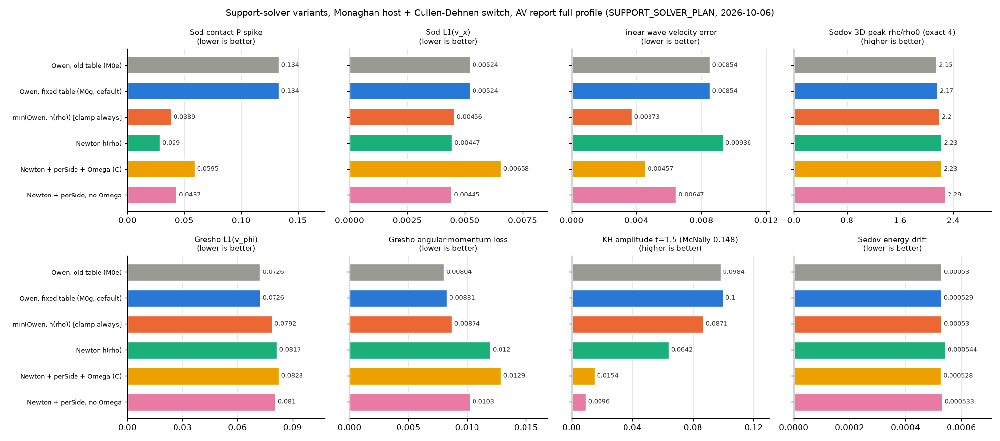

## Static toys

1D density step 1:8 (equal masses): h against the lattice h and against h(rho). Owen (neighbour count) over-grows h on the dense
side of the jump (+12 % vs h(rho)) and under-sizes it on the sparse side (-17 %); Newton sits on h(rho) by construction.

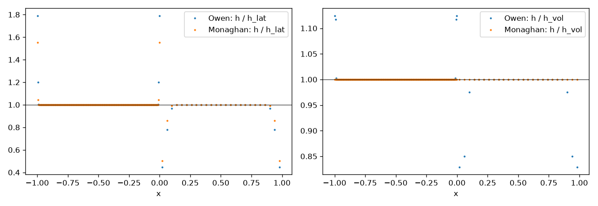

Uniform lattice (static, 64 iterations, B7, n_h 4): both solvers return to the target from h = 0.5x and 2x (no ratchet); with
the old table Owen settled at 1.0205 h_lat (2D) / 1.0088 (3D), with the fixed table at 1.0000 in 1D/2D/3D.

## Final frames (C&D, Monaghan host)

Kelvin-Helmholtz, t = 1.5 -- the deciding case. Owen rolls up; Newton less; the per-side forms break the interface into
particle mixing.

| Owen, fixed table (default) | min(Owen, h(rho)) | Newton | Newton + perSide + Omega | Newton + perSide, no Omega |
|---|---|---|---|---|
| 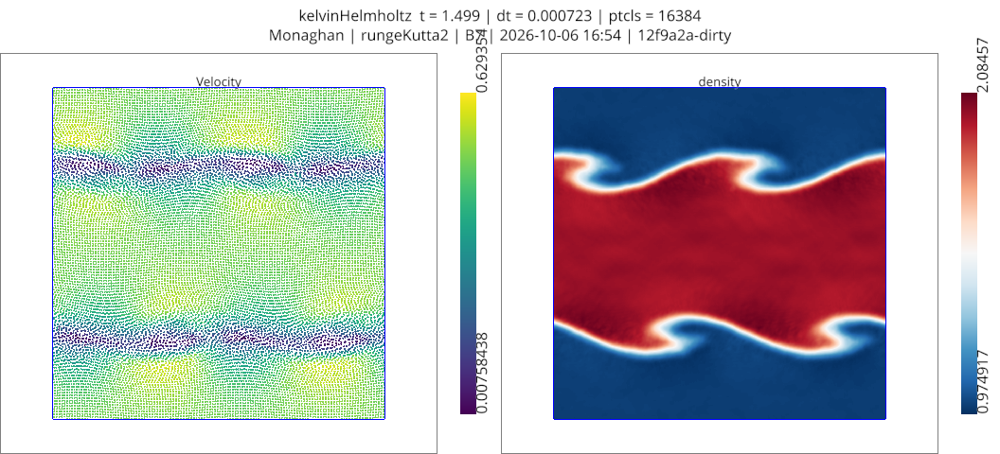 |  | 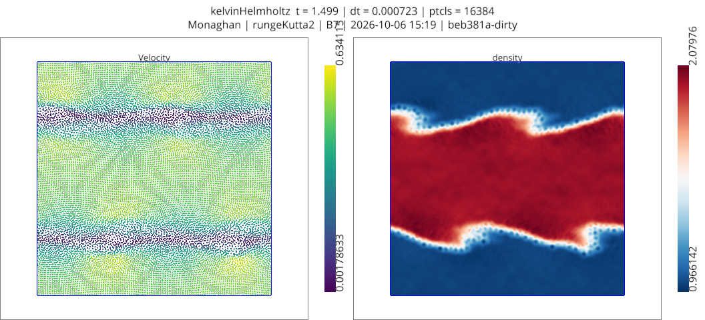 | 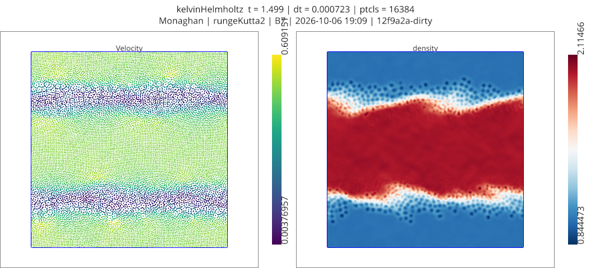 |  |

Sod (1D), final time -- where tying h to rho helps (contact pressure spike 0.134 -> 0.03-0.06).

| Owen, fixed table (default) | min(Owen, h(rho)) | Newton | Newton + perSide + Omega | Newton + perSide, no Omega |
|---|---|---|---|---|
|  | 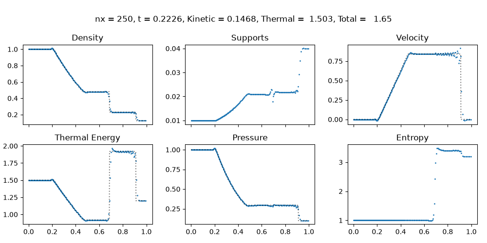 | 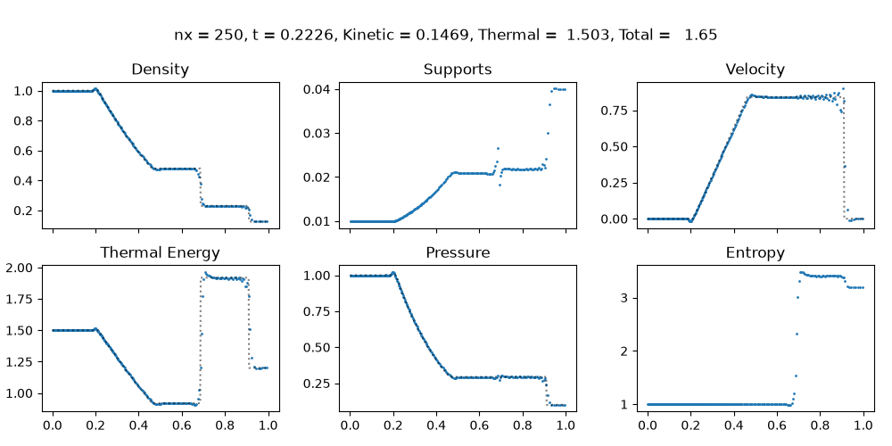 | 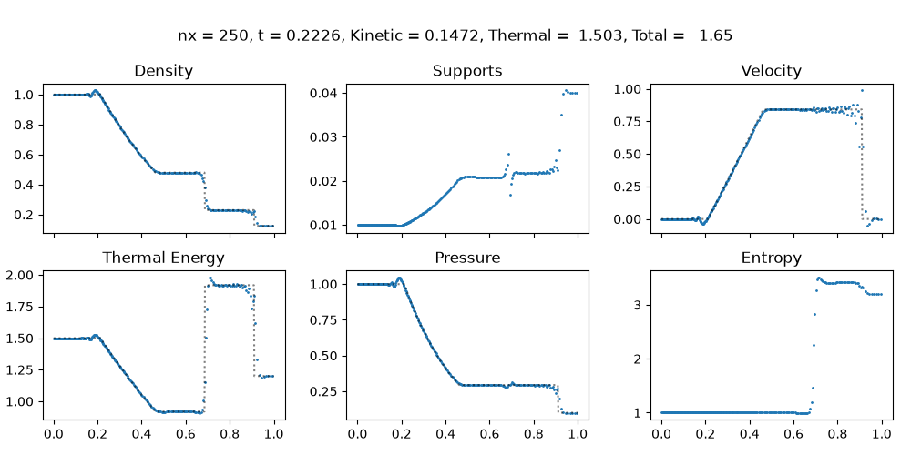 | 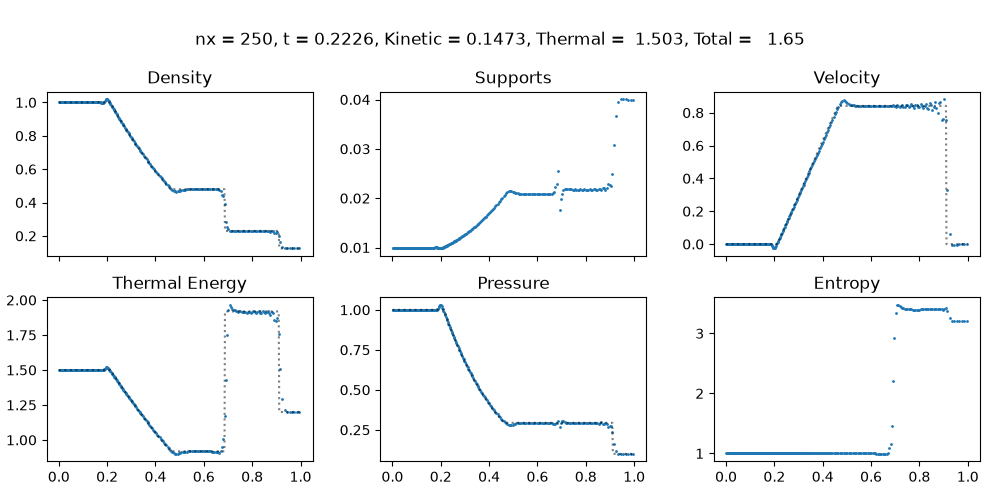 |

Gresho vortex, t = 3.

| Owen, fixed table (default) | min(Owen, h(rho)) | Newton | Newton + perSide + Omega | Newton + perSide, no Omega |
|---|---|---|---|---|
| 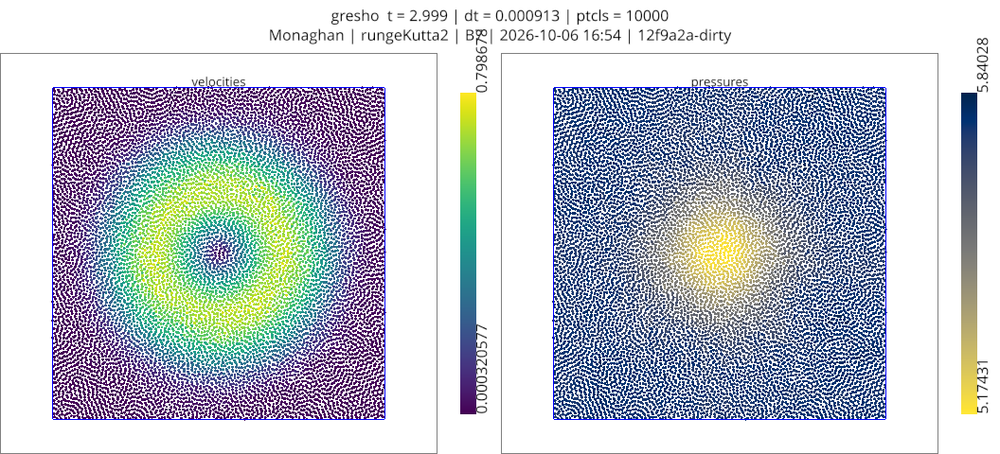 | 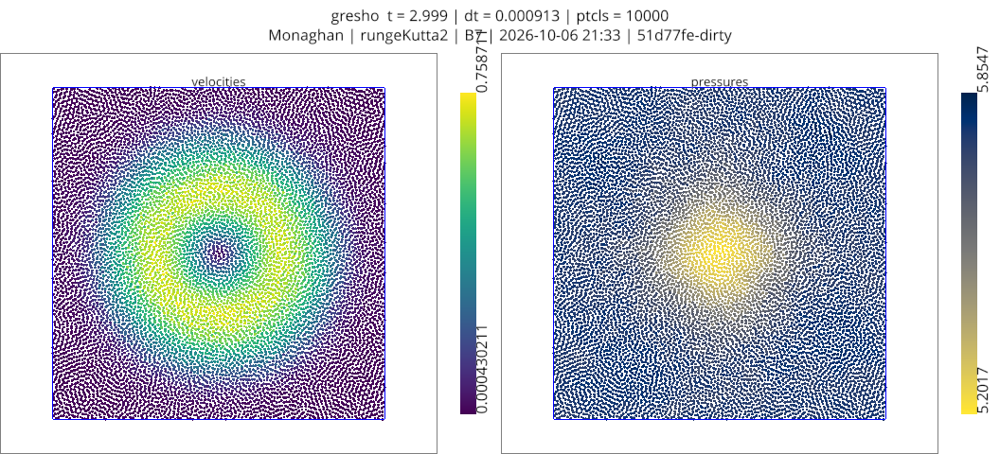 | 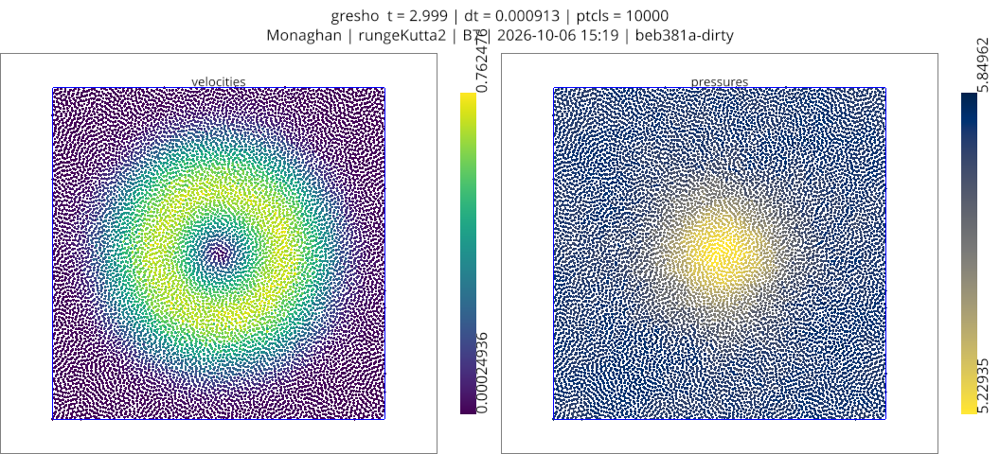 | 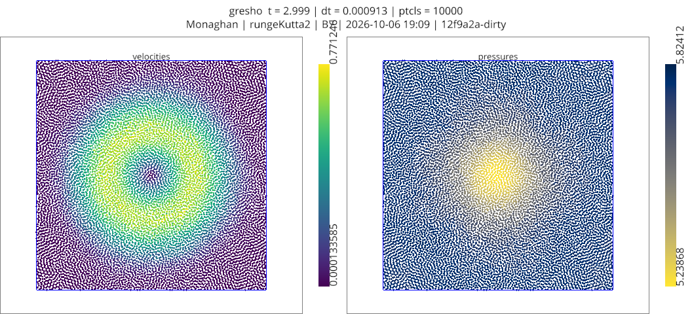 | 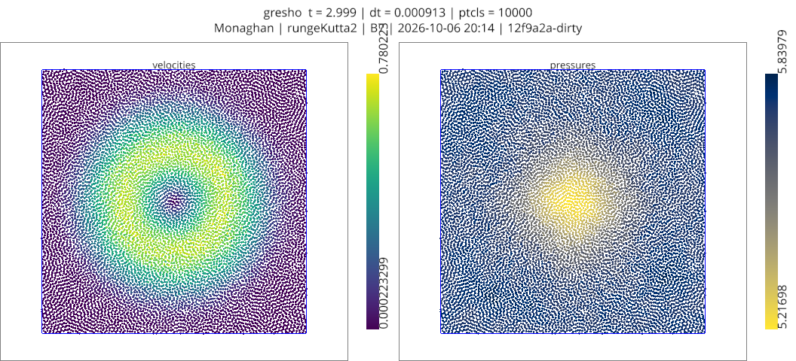 |

## Walls (shockReflection, Mach 2, t = 0.45, Monaghan, `scripts/probe_wallPressureDeficit.py`)

Near-wall rows, `p / p3 - 1` (outermost first):

| row | Owen, clamp off | Owen, wall clamp (default) | Newton, no clamp |
|---|---|---|---|
| 1 | -0.102 (h frozen 2x, coincident pair) | -0.009 | +0.076 |
| 2 | -0.102 | +0.030 | +0.094 |
| 3 | -0.121 | +0.007 | +0.025 |
| 4 | -0.090 | +0.007 | +0.023 |

| Owen, clamp off | Owen, wall clamp (default) | Newton |
|---|---|---|
| 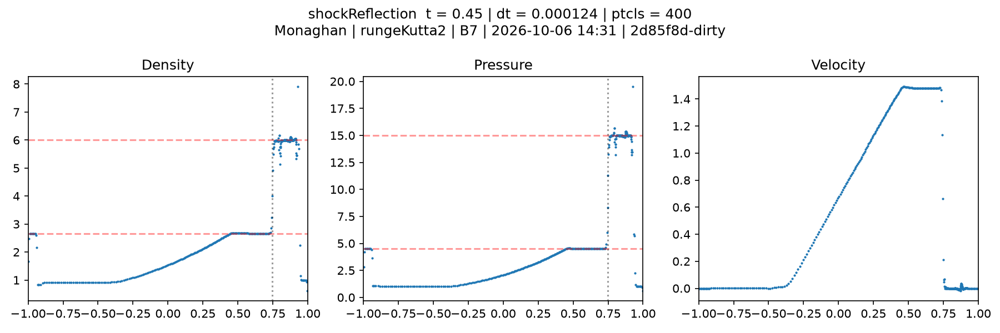 | 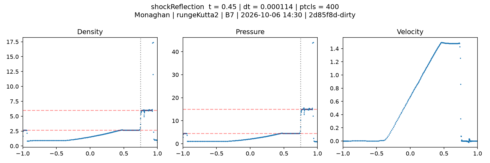 | 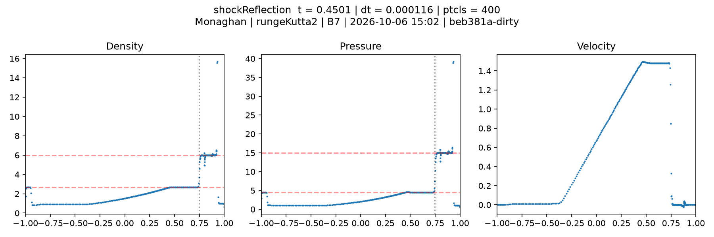 |

## Not in the figure

The repo's old grad-h path (`adaptiveSupportCorrections=True` with the default mean-kernel force) is not the Hamiltonian form
(Omega with a symmetrised kernel): Sedov energy drift 5.2e-4 -> 5.0e-2. The per-side operator fixes that (5.3e-4) and is
exactly conservative (`tests/test_perSidePressure.py`); it is the KH behaviour, not energy, that rules it out.
